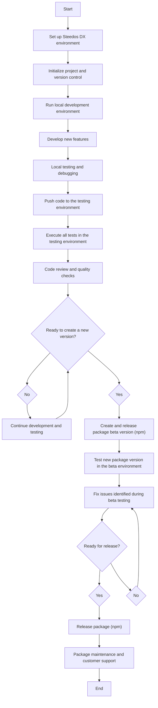

# What is Steedos DX Project?

Steedos DX Project is a workflow methodology for managing and developing Steedos applications, emphasizing a source-driven approach for more efficient version control and team collaboration. The Steedos DX project folder typically contains the following elements:

1. **Metadata**: These encompass all non-coded configurations, such as object definitions, fields, layouts, processes, validation rules, etc.

2. **Source Code**: This houses all source code for the application, including microservices, triggers, REST apis, visual components, micro pages, etc., organized within a structured directory for cleanliness and manageability.

3. **Resource Files**: These might include static resources like images, style sheets, JavaScript files, etc., enhancing the user interface.


## Project Structure

A Steedos DX project has a specific project structure and source format. Source format uses a different set of files and file extensions from what the Metadata API uses. When you retrieve metadata from the org with the project retrieve start command, Steedos CLI stores it in source format in your project. When you deploy metadata, Steedos CLI converts it into the format that the Metadata API requires.

```bash
my-project
├── steedos-packages
│   ├── package1
│   ├── package2
│   └── package3
├── steedos-platform
├── package.json
└── moleculer.config.js
```

### steedos-packages

When you create your Steedos DX project, you can organize your metadata into logical groupings by creating multiple package directories locally. You can group similar code and source for an application or customization to better organize your team’s repository. 

### steedos-platform

To develop a package, you need to connect to a Steedos Platform deployment . Navigate to the 'steedos-platform' folder to launch a local Steedos Platform.

### package.json

The `package.json` file is a fundamental element in virtually all projects that involve Node.js. It serves as a base source for defining various modules required in the project, among other configuration details. 


## Steedos DX Development Process

This entire process underscores agile development, continuous integration, and continuous delivery, allowing teams to quickly respond to changes and improve delivery quality.

1. **Environment Setup**: Developers need to set up their development environment, involving the installation of the Steedos CLI, Visual Studio Code, and other necessary plugins.

2. **Pulling Source Code**: Utilizing the Steedos CLI, developers pull the latest source code from the source repository.

3. **Local Development and Debugging**: Developers write and debug code in their local environments, using tools like the Nodejs Debugger for precision and robustness.

4. **Source Control**: Changes should be regularly committed to a version control system (like Git), enabling the sharing of alterations and acquisition of code from team members.

5. **Deployment and Testing**: With the Steedos CLI, developers can deploy local changes to a test environment for further testing and validation.

6. **Code Review and Merging**: Code reviews should be conducted before code is deployed to production. Once the code passes reviews and tests, it can be merged into the main branch and deployed to the production environment.


