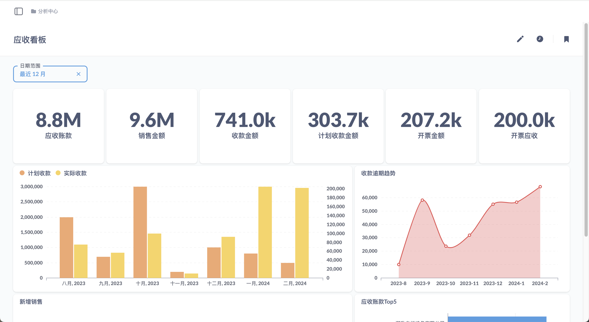
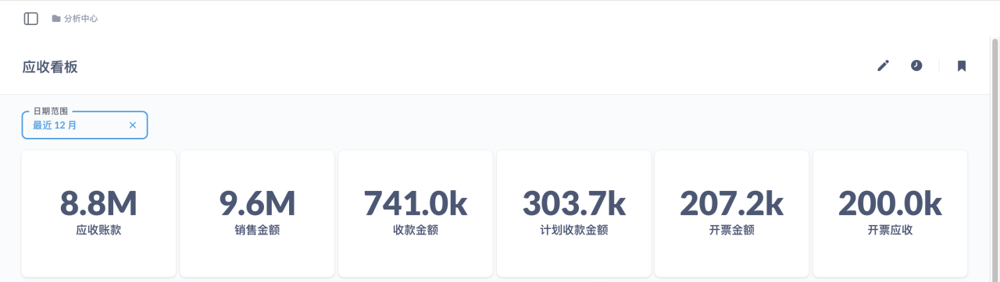

数据分析引擎提供了给用户一个友好的数据可视化工具，让用户可以在不需要编写代码的情况下探索和分析你的数据。这种整合赋予了华炎魔方用户以更高效、更易于理解的方式探索数据、制作报表和构建仪表板的能力。
利用平台的灵活性和丰富的可视化选项，让华炎魔方的客户可以快速从复杂的数据中提取有价值的洞察，无需深厚的技术背景。同时，为企业带来了数据驱动决策的新机遇，极大提升了业务分析的效率和效果。

## 报表

报表功能让用户能够以极其简单的方式对数据进行探索和分析。用户无需掌握任何编程或数据库查询语言，就可以通过几次点击生成复杂的数据查询。这项功能采用直观的图形界面，让用户可以选择数据源、设置筛选条件、并选择如何展示结果（例如图表或表格）。

## 仪表盘

仪表盘功能允许用户将多个查询结果集成到一个页面中，提供了一个高度定制化和动态的数据展示平台。用户可以在仪表盘中添加图表、表格、过滤器等组件，以创建全面的数据报告和分析视图。

## 权限

无需额外配置权限，无论是创建的报表还是将报表组合形成的仪表盘，统计分析平台数据权限直接继承华炎魔方对象权限；就会出现同一个报表或仪表盘不同业务权限的用户看到不同的数据的情况。

## 仪表盘参数

仪表盘展示页面除了可以放报表进行展示，在日常的应用中还会涉及到添加查询参数联动报表进行数据查询的场景，可以根据具体场景配置不同类型的查询参数。

## 添加到应用

创建好的仪表盘页面通过绑定选项卡后，添加到对应的应用中供用户进行访问查看。这样，用户就可以在前台看到对应的仪表盘页面了。

