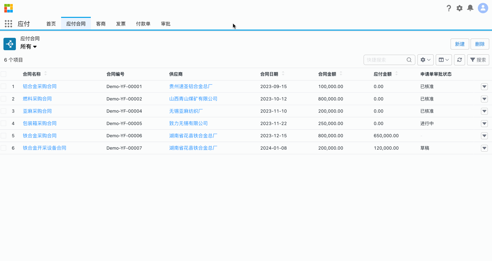
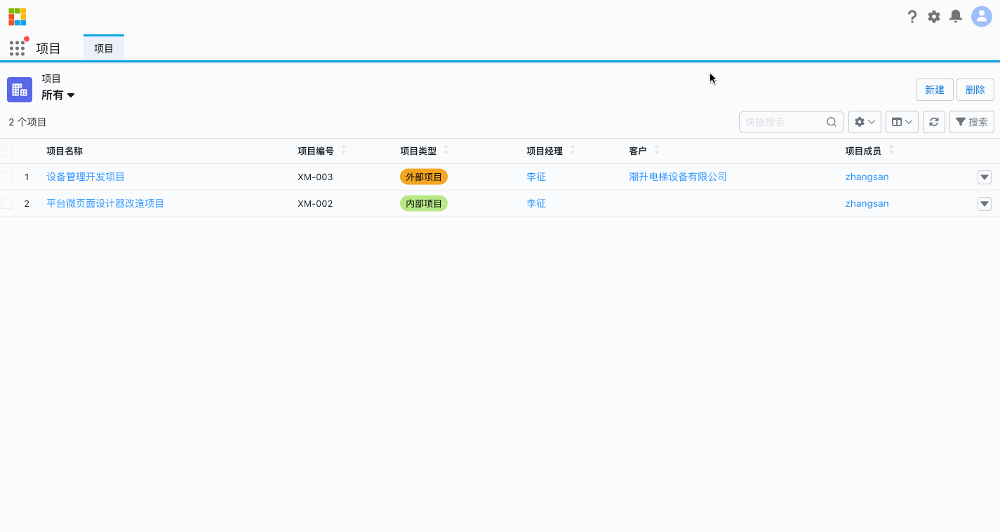
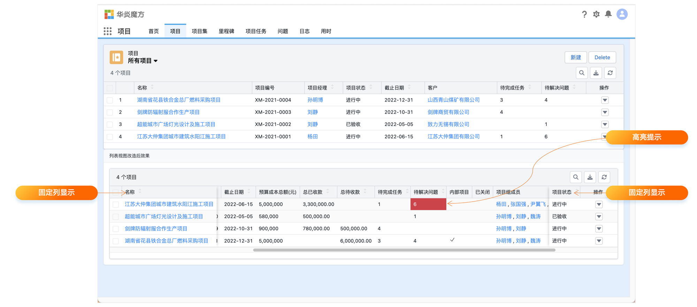
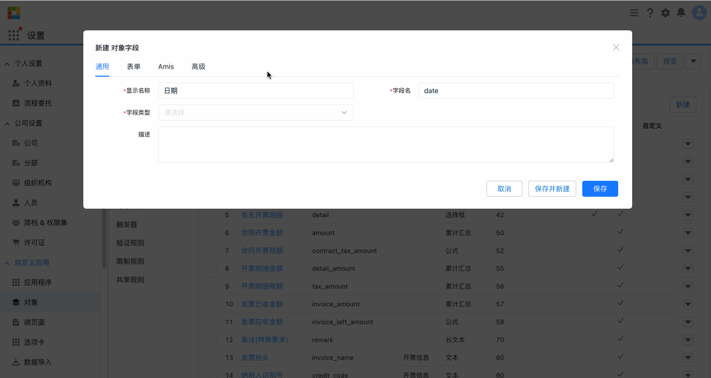
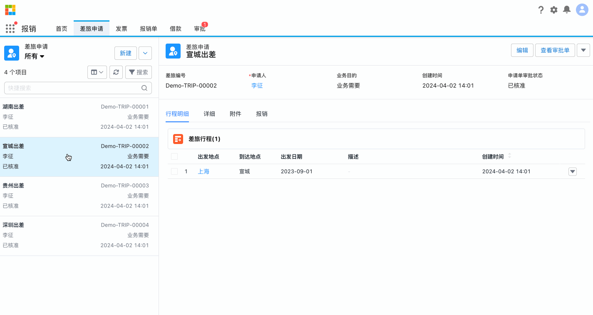
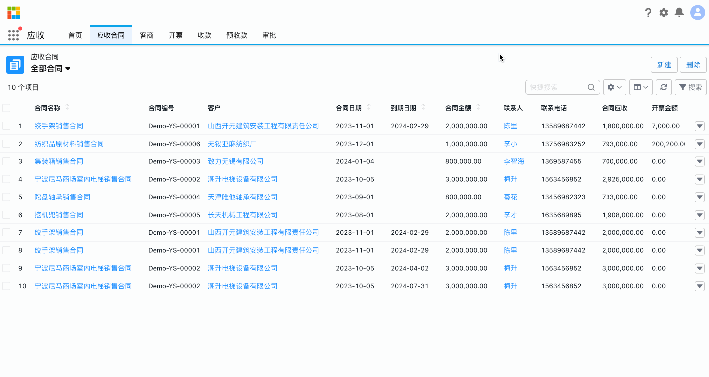
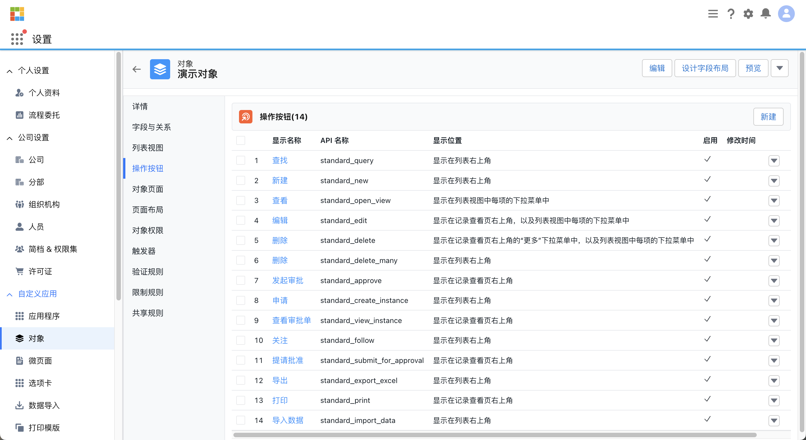

华炎魔方的数据建模功能是其闪亮的特色之一，为用户提供了一个强大而灵活的平台，用于构建和管理数据模型。这一功能使用户能够轻松地将各种数据源整合到一个统一的数据模型中，并通过高级的数据处理和分析功能，从中获取深入的洞察。

用户可以利用数据建模功能创建复杂的关系模型、定义计算字段和指标，并进行数据驱动的决策制定。无论是在业务智能、数据分析还是预测建模方面，华炎魔方的数据建模功能都能够为用户提供卓越的支持，助力其实现数据驱动的业务成功。

## 对象表单

### 自动填充
华炎魔方的对象表单自动填充功能是一项极具便利性和效率的特性，为用户提供了一种智能化的数据输入方式。通过该功能，用户在填写表单时，系统可以根据之前输入的数据或者设定的规则，自动填充相关字段，同时可以通过字段属性控制自动带出字段只读和可编辑属性，从而节省用户的时间和精力。无论是在快速创建新记录、提高数据输入准确性，还是简化重复性工作方面，对象表单自动填充功能都能够使用户在数据填写更加高效和便捷。

### 高亮字段

华炎魔方的对象高亮字段功能是一项极具实用性和视觉效果的特性，能够帮助用户快速识别和突出显示关键数据。通过设置该功能，可以在表格中将特定字段的数值以醒目的方式高亮显示，使其在大量数据中更易于被注意和理解。这一功能不仅提高了数据的可读性和可视化效果，还有助于用户快速发现数据中的异常情况或关键信息。

### 设计字段布局

华炎魔方的对象设计字段布局功能为用户提供了灵活而直观的界面设计工具，使其能够轻松地定制和优化数据录入界面。通过该功能，用户可以根据实际需求，自由调整对象表单中各个字段的布局和显示顺序，以及设置字段的可见性和必填性等属性。这样的设计自由度不仅有助于提升用户体验和操作效率，还能够根据不同角色或场景定制不同的表单布局，满足各种复杂业务需求。

### 动态显隐

华炎魔方的字段动态显隐功能为用户提供了一个智能化的界面设计工具，使其能够根据特定条件动态控制字段或详情页相关表的显示与隐藏。通过该功能，用户可以根据不同的业务逻辑或用户角色，动态地设置可见性，从而简化表单界面，使其更加清晰和易于操作。这一功能不仅提高了用户界面的灵活性和定制性，还可以根据实际需求动态地调整数据录入界面，减少了用户的操作复杂度，提升了工作效率。

### amis自定义字段

使用AMis自定义字段功能，用户可以根据自身业务需求，轻松地添加、调整和配置各种自定义字段，包括文本、数字、日期等多种类型。这使得用户可以根据特定的业务场景，自由设计和构建符合实际需求的数据录入界面，提高了界面的灵活性和适用性。AMis自定义字段功能不仅简化了界面开发流程，还为用户提供了更加个性化和专业化的界面定制方案，为数据管理提供了更高水平的支持。

### amis自定义表单

使用AMis自定义表单功能，用户可以轻松地添加、删除、调整和配置表单中的各种字段和控件，以及定义数据校验规则和业务逻辑，从而实现个性化的数据录入界面。这一功能不仅提高了用户的操作灵活性和效率，还能够满足不同业务场景下的定制化需求，为用户提供更加专业和便捷的数据管理解决方案。

### 验证规则

在华炎魔方平台中，数据验证规则功能是一个显著的亮点。该功能允许用户定义和配置各种数据验证规则，以确保用户在新建或者编辑数据时的准确性。通过数据验证规则，用户可以在数据保存之前对其进行验证，以确保符合预期的业务逻辑和规范。当数据不符合规则时，系统会自动触发警告或阻止保存，提供实时的数据质量保障。这一功能使得数据在录入和管理过程中更加可靠，减少了错误和不一致性，从而提高了工作效率和数据质量。

比如：用户可以创建验证规则，使得每一个“业务机会”的“金额”数值必须大于1000，否则拒绝保存。验证规则适用于对象被添加或更改的所有场景。

## 创建对象

### 自动生成关联业务对象

在华炎魔方平台中，对象设置提供了自动创建附件、任务、日程和备忘等相关业务对象的功能。用户可以通过简单配置规则，使系统在特定条件下自动执行这些操作，从而提高工作效率和管理能力。这些功能让用户能够更轻松地管理业务数据和工作流程，确保信息完整性和及时性。

### 记录字段历史

华炎魔方平台的对象设置中，审计日志功能是一个亮点。这个功能允许管理员和用户跟踪和记录系统中发生的所有关键操作和事件，主要包括记录创建、修改。审计日志提供了详细的记录和时间戳，帮助用户监控数据的访问和变化情况。通过审计日志，用户可以确保数据的安全性和完整性，并且满足合规性要求。

### 业务审批

业务对象的数据也可以对接审批引擎实现台账数据的审批，在这一功能使得用户能够轻松地设置和管理针对特定业务对象的审批流程。用户可以定义审批流程的各个阶段、参与者和条件，确保业务流程按照预期的规则进行。审批功能还提供了实时的审批状态跟踪和通知，让用户能够及时了解审批进度并做出相应的处理。不仅提高了业务流程的可控性和透明度，也大大提升了工作效率和管理效能。

### 锁定子表

锁定子表功能结合了流程审批，实现了对对象子表记录的新增和修改的锁定。用户在创建业务对象的主表和子表记录后，可以发起流程审批。一旦发起并提交审批，相关记录的状态将变为锁定状态，从而禁止用户对其进行新增或修改操作。这一功能满足了某些场景下对数据安全性和完整性的业务需求，禁止数据在流程审批期间随意修改，保证数据的准确性。

## 创建字段

### 基本字段类型

支持创建各种常见的业务字段类型，包括文本、长文本、HTML文本、代码、Markdown文本、选择框、颜色、复选框、开关、日期、日期时间、时间、数值、金额、百分比、密码、网址、邮件地址、地理位置、图片、附件、自动编号、公式、累计汇总、相关表关系、主/子表关系等。同时在创建字段时可以设置一些字段的基本属性比如可以设置必填、排序号、宽字段、提示信息以及可以通过公式编辑器设置默认值等。

其中，自动编号、公式、累计汇总可实现系统自动取值；相关表关系、主/子表关系用于定义对象之间的关系。

### 自动编号字段

表单或报表中经常需要使用序列号或者唯一编号，比如单号、编号等，当需要定义一个规则来自动生成所需的序列号时，我们可以使用自动编号类型字段。

比如常见的自动编号规则为字符-年-月-日-三位流水号就可以通过简单的 `SN-{YYYY}-{MM}-{DD}-{000}` 公式来实现；

除了简单的自动编号规则外，还支持复杂场景下的自动编号规则，比如合同昌场景下，编号规则基础上增加了逻辑判断，如果合同金额大于十万则把前缀 SN 换为 IM 以表示重要合同，那么公式中也可以引入函数来实现，那么就可以写成 `IF(amount > 100000, "IM-{YYYY}{MM}-{DD}-{000}", "SN-{YYYY}-{MM}-{DD}-{000}")` 这样的公式；

因此借助华炎魔方的公式引擎，根据实际的业务场景可以写出很复杂的自动编号规则。

### 公式字段

借助公式引擎，公式字段可以帮助非程序员快速实现一些简单的业务逻辑，类似Excel公式，它是从其他字段、表达式或值派生其值的一种算法，通过公式字段，可以帮助您根据其他字段自动计算一个字段的值。

常见的场景主要涉及到使用公式进行数值计算、联动带出相关业务对象字段信息、以及借助公式殷勤函数做复杂的字段处理；

### 累计汇总字段

当前业务对象有子表，并且需要对子表数据进行汇总计算的情况下可以使用累计汇总类型字段；例如，要在客户的发票相关列表中显示所有相关发票自定义对象记录的发票总金额。那么就可以在名为“发票总金额”的自定义金额字段中定义这一汇总信息。

除了汇总，也可以叠加过滤条件来计算子表中字段的记录数、总和、均值、最小值或最大值。

### 字段默认值

支持配置字段的默认值，可以是固定的文本或数值，也可以通过借助公式引擎来配置动态默认值。

## 定义对象关系

### 相关表关系

当我们需要描述两个对象之间的关联关系时，可以在其中一个对象中创建一个“相关表关系”类型字段来关联两个对象。

比如每个“报价”记录都应该有对应的“所属客户”与之关联，此时我们可以在“报价”对象上创建一个“报价客户”字段跟“客商”对象关联起来。同时相关表关系类型支持多选和设置默认值等基础功能。

### 主子表关系

在相关表字段的基础上，我们可以通过创建一个“主/子表关系”类型字段来描述两个对象间的主从关系，需要注意的是应该把“主/子表关系”字段添加到“子表”的对象字段中，来表示“子表”对象是通过这个字段来关联其“主表”的，而不是把“主/子表关系”字段添加到“主表”的对象字段中。

比如 “报价行条目” 都应该有对应的 “报价” 与之关联，此时我们可以在 ”报价行条目“ 对象上建立一个 “报价名称” 字段，类型为主表/子表跟 “报价” 对象关联起来。设置了“主/子表关系”类型的字段后，主表可以再记录详情页的“相关”Tab页签里看到所有与该记录相关联的子表对象记录。

## 列表视图

### 树形展示数据

在华炎魔方平台的对象设置中，开启树形展示功能开关后，它允许用户将相关数据以树形结构的方式展示，使得数据间的层级关系更加清晰和直观。通过启用树形展示，用户可以轻松地查看和管理复杂的数据结构，加深对数据之间关联的理解。

### 列表行编辑

在华炎魔方平台的对象设置中，行编辑功能是一个非常实用的功能。这一功能使得用户能够直接在列表视图中对数据进行编辑，而无需进入单独的记录页面。通过简单的点击，用户可以快速地编辑单元格中的数据，然后保存更改。这样的设计大大提高了用户的操作效率，尤其是在需要批量编辑数据时更为方便。行编辑功能使得数据管理变得更加快捷、简便，极大地提升了用户的工作效率。

### 列分屏视图

分屏视图功能可以在创建对象时设置，也可以在用户前台页面针对具体业务对象单独设置。该功能使用户能够在同一屏幕上同时查看两个或多个不同的视图或记录。通过分屏视图，用户可以更轻松地比较和操作不同数据之间的关系，针对列表页面又提供了另外的一种展示方式

### 自定义列表视图

用户可以根据自己的需求，灵活地创建和定制列表视图，以便更有效地管理和查看数据，这一功能允许用户选择要显示的字段、设置筛选条件和排序方式，从而将数据呈现得更加清晰和具有针对性。用户还可以保存自定义视图，方便日后快速访问和使用。

同时创建的列表视图也可以通过共享设置共享给相关业务人员。自定义列表视图功能大大提高了用户的工作效率，使其能够更轻松地定位和处理所需的数据，实现了个性化的数据管理体验。

### 自定义搜索项

平台除了列表的模糊搜索框外，还允许用户根据自己的需求，在默认设置的字段搜索项上自定义需要的搜索字段条件，以便更有效地查找和筛选数据。用户可以选择要搜索的字段，并设置相应的搜索条件，例如等于、包含、大于等。自定义列表搜索项功能为用户提供了更便捷、更个性化的数据查找和管理体验，是华炎魔方平台的一个重要亮点。

## 操作按钮

### 标准按钮

在华炎魔方平台中，通过数据建模生成的默认操作按钮功能是一个备受瞩目的亮点。这一功能使得用户在创建业务对象时，系统会自动生成标准的操作按钮，包括常见的新增、编辑、删除等操作。这些按钮与数据模型自动关联，无需用户额外配置。用户只需在数据建模阶段定义对象及其属性，系统将根据这些信息自动生成相应的操作按钮，简化了用户的操作流程。这一功能的存在极大地提高了用户的开发效率，减少了手动配置的工作量，使得华炎魔方平台在数据管理方面更加智能和便捷。

### 自定义按钮

该功能允许用户根据自己的需求，借助表单设计器，自定义各种操作按钮，以便在界面上快速执行特定的操作。用户可以创建按钮并将其添加到适当的位置，例如列表视图、记录详细页面等。这些操作按钮可以触发各种操作，例如创建新记录、导出数据、触发流程、发送电子邮件等。通过操作按钮功能，用户能够更快捷地完成常见任务，提高工作效率。这一功能的灵活性和定制性使得华炎魔方平台能够满足各种不同业务场景下的需求，为用户提供了更加个性化和便捷的用户体验。

