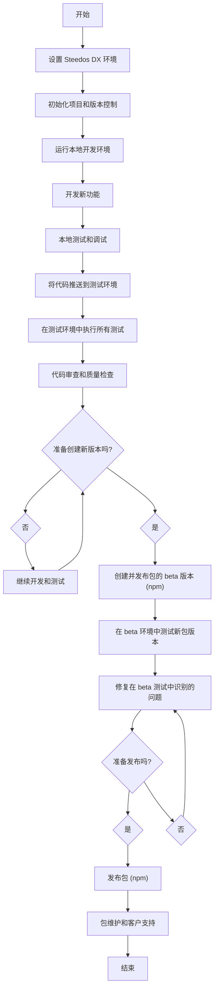

# Steedos DX 项目

Steedos DX 项目是一种用于管理和开发 Steedos 应用程序的工作流方法，强调源代码驱动的方法，以实现更有效的版本控制和团队协作。Steedos DX 项目文件夹通常包含以下元素：

1. **元数据**：这些包括所有非编码配置，如对象定义、字段、布局、流程、验证规则等。

2. **源代码**：这里包含应用程序的所有源代码，包括微服务、触发器、REST API、视觉组件、微页面等，这些都在一个结构化目录中有条理地组织起来，以保持整洁和可管理性。

3. **资源文件**：这可能包括静态资源，如图像、样式表、JavaScript 文件等，增强用户界面。


## 项目结构

Steedos DX 项目有特定的项目结构和源格式。源格式使用的文件集和文件扩展名与 Metadata API 使用的不同。当您使用项目检索开始命令从 org 检索元数据时，Steedos CLI 将其以源格式存储在您的项目中。当您部署元数据时，Steedos CLI 将其转换为 Metadata API 所需的格式。

```bash
my-project
├── steedos-packages
│   ├── package1
│   ├── package2
│   └── package3
├── steedos-platform
├── package.json
└── moleculer.config.js
```

### steedos-packages

当您创建 Steedos DX 项目时，可以通过在本地创建多个包目录来将元数据组织成逻辑分组。您可以将类似的代码和源代码分组到一个应用程序或自定义中，以更好地组织您团队的存储库。

### steedos-platform

要开发一个包，您需要连接到一个 Steedos Platform 部署。导航到 'steedos-platform' 文件夹以启动本地 Steedos Platform。

### package.json

`package.json` 文件在几乎所有涉及 Node.js 的项目中都是基本元素。它作为定义项目中所需的各种模块以及其他配置细节的基础来源。


## Steedos DX 开发流程

整个过程强调敏捷开发、持续集成和持续交付，使团队能够快速响应变化并提高交付质量。

1. **环境设置**：开发者需要设置他们的开发环境，包括安装 Steedos CLI、Visual Studio Code 和其他必要的插件。

2. **拉取源代码**：利用 Steedos CLI，开发者从源代码仓库拉取最新的源代码。

3. **本地开发和调试**：开发者在他们的本地环境中编写和调试代码，使用像 Nodejs Debugger 这样的工具来确保精确性和稳健性。

4. **源代码控制**：应定期将更改提交到版本控制系统（如 Git），以便共享修改并获取团队成员的代码。

5. **部署和测试**：通过 Steedos CLI，开发者可以将本地更改部署到测试环境进行进一步的测试和验证。

6. **代码审查和合并**：在代码部署到生产环境之前应进行代码审查。一旦代码通过审查和测试，它可以被合并到主分支并部署到生产环境。


