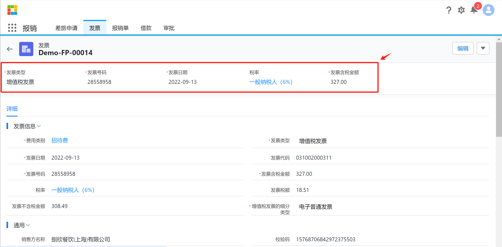
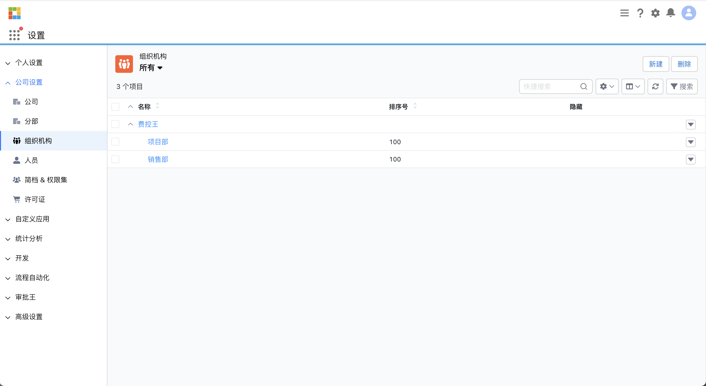
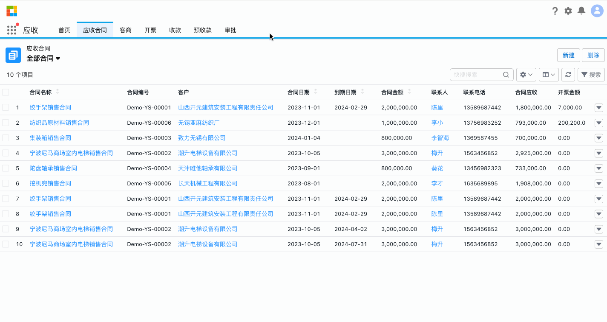
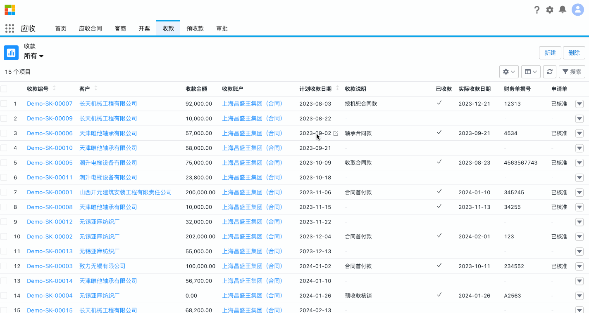

Steedos App Builder 是一款强大的应用程序开发工具，旨在帮助企业和开发者快速创建和定制业务应用程序。它提供了可视化的界面和丰富的功能组件，使用户可以在无需大量编码的情况下构建应用程序。

- **可视化界面**：通过拖放操作，用户可以轻松设计页面、表单和列表视图，无需编写复杂的代码。

- **自定义业务对象**：允许用户创建和定义业务对象，以满足特定的业务需求。这包括自定义字段、页面布局、按钮、菜单等。

- **数据权限管理**：提供强大的权限控制功能，支持角色、应用、对象、记录和字段级别的权限设置，确保数据的安全和访问控制。

- **自动化**：支持条件触发和定时触发的自动化规则，简化业务流程，提高工作效率。

- **流程审批**：提供可视化的流程设计器，支持审批单和流程节点的设计，并具有流程权限管理、移动审批和其他审批相关功能。

- **代码开发支持**：虽然 Steedos App Builder 主要面向低代码开发，但它也支持代码开发功能，如标准 API、自定义 API、自定义触发器等，方便开发者进行更高级的定制。

- **数据分析**：提供数据分析工具，支持自定义报表、仪表盘和多表联查等功能，帮助企业做出数据驱动的决策。

- **扩展插件**：Steedos App Builder 支持多种扩展插件，如企业微信、钉钉、单点登录等，增强了平台的灵活性和兼容性。

- **技术支持和云服务**：提供技术支持服务，包括社区支持、标准服务和金牌服务等。此外，还提供云服务选项，如统一身份认证、代码仓库和远程开发环境。

Steedos App Builder 是一款灵活且功能强大的工具，适合企业和开发者用于快速构建和定制业务应用程序。

## 记录详情页

### 高亮字段

华炎魔方的对象高亮字段功能是一项极具实用性和视觉效果的特性，能够帮助用户快速识别和突出显示关键数据。通过设置该功能，可以在表格中将特定字段的数值以醒目的方式高亮显示，使其在大量数据中更易于被注意和理解。这一功能不仅提高了数据的可读性和可视化效果，还有助于用户快速发现数据中的异常情况或关键信息。

## 列表视图

### 树形展示数据

在华炎魔方平台的对象设置中，开启树形展示功能开关后，它允许用户将相关数据以树形结构的方式展示，使得数据间的层级关系更加清晰和直观。通过启用树形展示，用户可以轻松地查看和管理复杂的数据结构，加深对数据之间关联的理解。

### 列表行编辑

在华炎魔方平台的对象设置中，行编辑功能是一个非常实用的功能。这一功能使得用户能够直接在列表视图中对数据进行编辑，而无需进入单独的记录页面。通过简单的点击，用户可以快速地编辑单元格中的数据，然后保存更改。这样的设计大大提高了用户的操作效率，尤其是在需要批量编辑数据时更为方便。行编辑功能使得数据管理变得更加快捷、简便，极大地提升了用户的工作效率。

### 列分屏视图

分屏视图功能可以在创建对象时设置，也可以在用户前台页面针对具体业务对象单独设置。该功能使用户能够在同一屏幕上同时查看两个或多个不同的视图或记录。通过分屏视图，用户可以更轻松地比较和操作不同数据之间的关系，针对列表页面又提供了另外的一种展示方式

### 自定义列表视图

用户可以根据自己的需求，灵活地创建和定制列表视图，以便更有效地管理和查看数据，这一功能允许用户选择要显示的字段、设置筛选条件和排序方式，从而将数据呈现得更加清晰和具有针对性。用户还可以保存自定义视图，方便日后快速访问和使用。

同时创建的列表视图也可以通过共享设置共享给相关业务人员。自定义列表视图功能大大提高了用户的工作效率，使其能够更轻松地定位和处理所需的数据，实现了个性化的数据管理体验。

### 自定义搜索项

平台除了列表的模糊搜索框外，还允许用户根据自己的需求，在默认设置的字段搜索项上自定义需要的搜索字段条件，以便更有效地查找和筛选数据。用户可以选择要搜索的字段，并设置相应的搜索条件，例如等于、包含、大于等。自定义列表搜索项功能为用户提供了更便捷、更个性化的数据查找和管理体验，是华炎魔方平台的一个重要亮点。

## 操作按钮

### 标准按钮

在华炎魔方平台中，通过数据建模生成的默认操作按钮功能是一个备受瞩目的亮点。这一功能使得用户在创建业务对象时，系统会自动生成标准的操作按钮，包括常见的新增、编辑、删除等操作。这些按钮与数据模型自动关联，无需用户额外配置。用户只需在数据建模阶段定义对象及其属性，系统将根据这些信息自动生成相应的操作按钮，简化了用户的操作流程。这一功能的存在极大地提高了用户的开发效率，减少了手动配置的工作量，使得华炎魔方平台在数据管理方面更加智能和便捷。

### 自定义按钮

该功能允许用户根据自己的需求，借助表单设计器，自定义各种操作按钮，以便在界面上快速执行特定的操作。用户可以创建按钮并将其添加到适当的位置，例如列表视图、记录详细页面等。这些操作按钮可以触发各种操作，例如创建新记录、导出数据、触发流程、发送电子邮件等。通过操作按钮功能，用户能够更快捷地完成常见任务，提高工作效率。这一功能的灵活性和定制性使得华炎魔方平台能够满足各种不同业务场景下的需求，为用户提供了更加个性化和便捷的用户体验。

