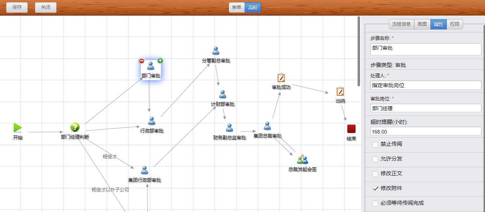

审批王是一个旨在帮助企业简化和自动化业务审批流程的工具。它提供了直观的可视化设计界面，使用户能够创建、管理和自动化各种审批流程，而无需深入的编程知识。

- **可视化审批设计**：用户可以通过拖放方式设计审批单和流程节点，轻松配置业务流程。这种直观的设计方式减少了传统流程设计的复杂性。

- **流程权限管理**：审批王提供了强大的权限管理功能，允许用户基于角色、部门、团队等设置不同级别的访问和操作权限，确保业务数据的安全和保密。

- **多种审批模式**：支持多种审批模式，包括顺序审批、并行审批和条件触发审批。用户可以根据具体的业务需求配置流程。

- **移动审批**：审批王支持移动客户端，让用户随时随地进行审批操作。这有助于加快审批流程，提高工作效率。

- **流程效率统计**：提供流程统计功能，帮助企业跟踪审批流程的效率，识别瓶颈，并优化流程设置。

- **批量审批**：允许用户批量处理审批请求，提高审批速度，节省时间。

- **流程导入导出**：支持将流程设计导入和导出，方便备份和在不同环境之间迁移。

- **审批催办与代理**：提供审批催办功能，提醒相关人员及时处理审批请求。此外，还支持审批代理，允许其他人代替原审批人进行审批。

- **条件节点与流程滑步**：支持根据条件动态调整流程节点的路径，并支持流程滑步，以应对特殊情况或审批人不可用的情形。

审批王作为企业审批管理的利器，能够帮助企业实现审批流程的标准化、自动化和移动化，从而提高业务效率，减少人为错误，确保合规性。