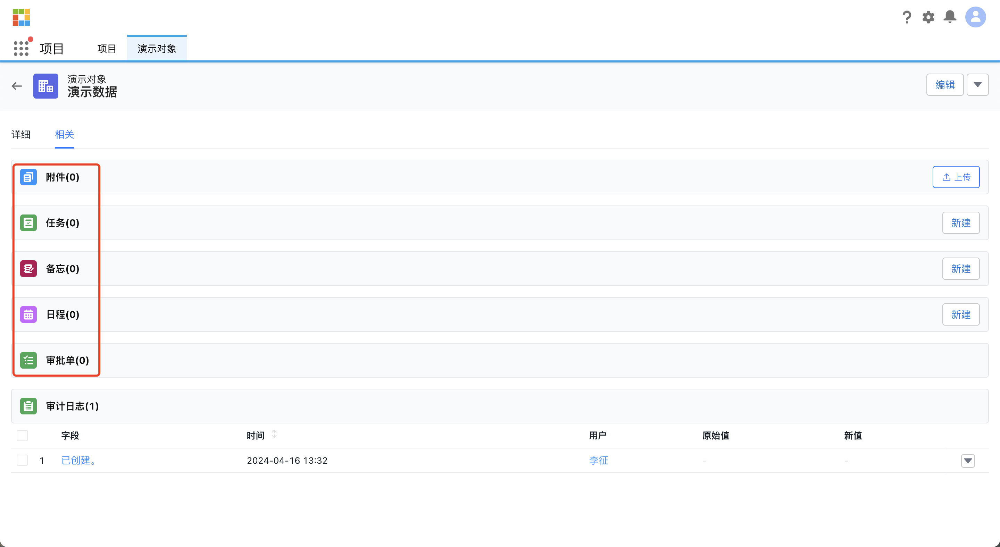
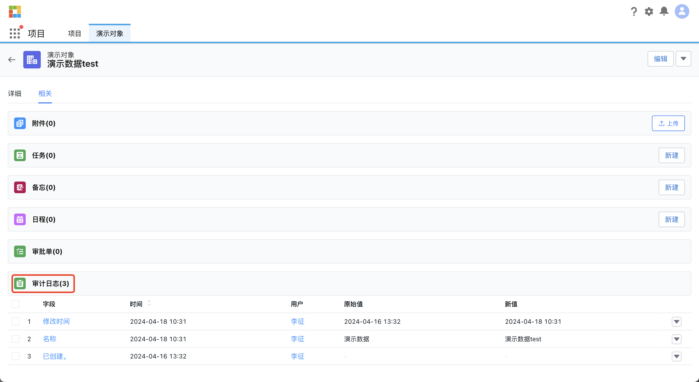
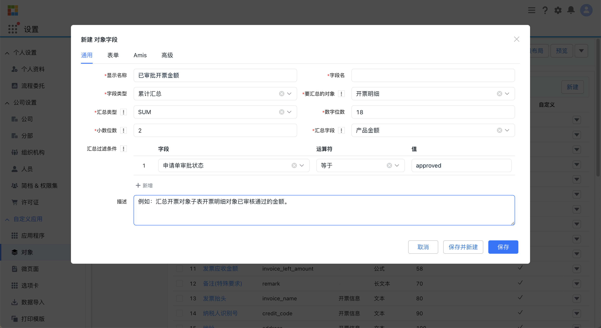
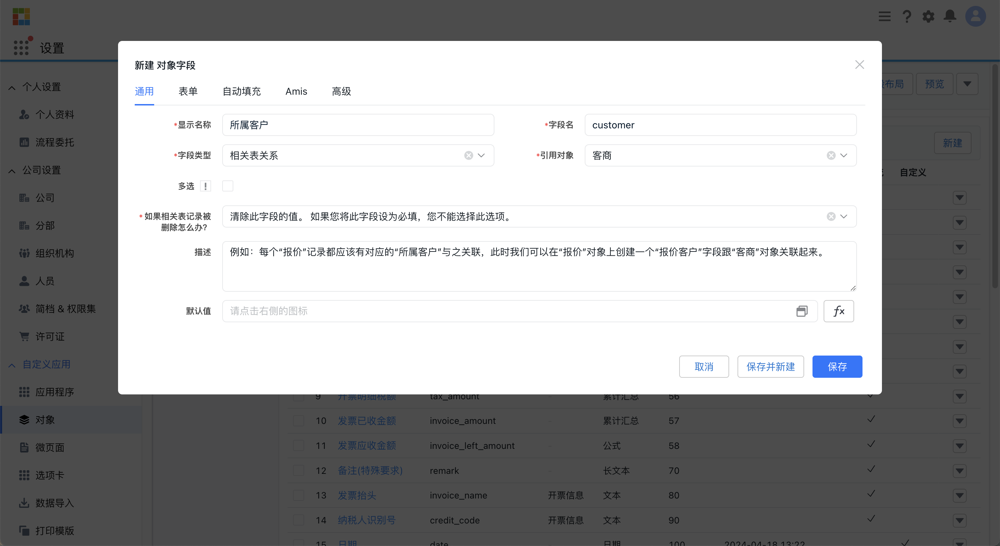
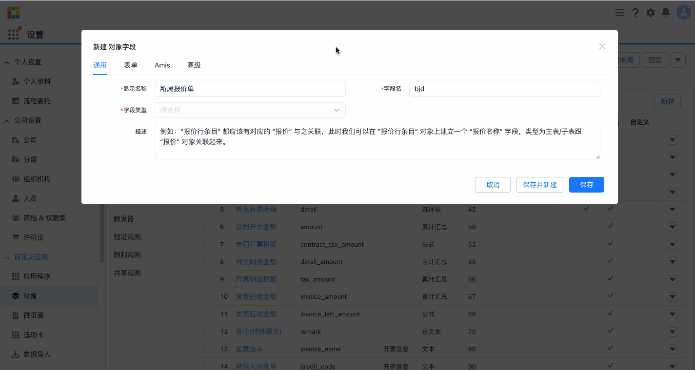

Steedos 数据建模引擎是 Steedos 平台的一个核心功能，旨在帮助企业和开发者定义、管理和操作业务数据。它提供了灵活的数据模型设计和丰富的功能，使用户能够快速构建适合自身业务需求的数据结构。

- **自定义业务对象**：用户可以创建自定义业务对象，定义业务实体，如客户、订单、产品等。每个业务对象可以包含一组自定义字段和关联关系。

- **多种字段类型**：Steedos 数据建模支持多种字段类型，包括文本、数字、日期、布尔值、下拉菜单、文件等。这些字段类型满足不同的业务需求。

- **字段联动**：允许字段之间建立联动关系，支持根据特定条件动态改变字段的可见性、值或状态。字段联动使表单和页面更具互动性。

- **字段权限管理**：提供字段级别的权限控制，用户可以根据角色、用户组或其他条件设置字段的可见性和编辑权限，确保数据安全。

- **数据关系**：Steedos 数据建模支持定义数据对象之间的关系，如一对一、一对多和多对多。这种关系建模有助于构建复杂的业务逻辑和数据结构。

- **数据校验和约束**：允许用户为字段设置校验规则和约束条件，如必填、唯一性、数据格式等，确保数据的准确性和规范性。

- **自定义列表视图**：用户可以为业务对象创建自定义的列表视图，选择要显示的字段、排序方式等。这有助于数据的快速浏览和管理。

- **自定义页面布局**：允许用户为业务对象设计页面布局，包括表单、详情页等。用户可以根据业务需求灵活调整页面的结构。

- **自定义按钮和菜单**：支持添加自定义按钮和菜单，为数据操作和交互提供更多选择。

Steedos 数据建模为企业提供了强大的数据管理和业务建模能力，使得企业能够轻松定义和管理业务数据，同时确保数据的安全性和规范性。借助这个工具，用户可以创建与业务需求相符的数据模型，为后续的开发和自动化奠定坚实的基础。

## 创建对象

### 自动生成关联业务对象

在华炎魔方平台中，对象设置提供了自动创建附件、任务、日程和备忘等相关业务对象的功能。用户可以通过简单配置规则，使系统在特定条件下自动执行这些操作，从而提高工作效率和管理能力。这些功能让用户能够更轻松地管理业务数据和工作流程，确保信息完整性和及时性。

### 记录字段历史

华炎魔方平台的对象设置中，审计日志功能是一个亮点。这个功能允许管理员和用户跟踪和记录系统中发生的所有关键操作和事件，主要包括记录创建、修改。审计日志提供了详细的记录和时间戳，帮助用户监控数据的访问和变化情况。通过审计日志，用户可以确保数据的安全性和完整性，并且满足合规性要求。

### 业务审批

业务对象的数据也可以对接审批引擎实现台账数据的审批，在这一功能使得用户能够轻松地设置和管理针对特定业务对象的审批流程。用户可以定义审批流程的各个阶段、参与者和条件，确保业务流程按照预期的规则进行。审批功能还提供了实时的审批状态跟踪和通知，让用户能够及时了解审批进度并做出相应的处理。不仅提高了业务流程的可控性和透明度，也大大提升了工作效率和管理效能。

### 锁定子表

锁定子表功能结合了流程审批，实现了对对象子表记录的新增和修改的锁定。用户在创建业务对象的主表和子表记录后，可以发起流程审批。一旦发起并提交审批，相关记录的状态将变为锁定状态，从而禁止用户对其进行新增或修改操作。这一功能满足了某些场景下对数据安全性和完整性的业务需求，禁止数据在流程审批期间随意修改，保证数据的准确性。

## 创建字段

### 基本字段类型

支持创建各种常见的业务字段类型，包括文本、长文本、HTML文本、代码、Markdown文本、选择框、颜色、复选框、开关、日期、日期时间、时间、数值、金额、百分比、密码、网址、邮件地址、地理位置、图片、附件、自动编号、公式、累计汇总、相关表关系、主/子表关系等。同时在创建字段时可以设置一些字段的基本属性比如可以设置必填、排序号、宽字段、提示信息以及可以通过公式编辑器设置默认值等。

其中，自动编号、公式、累计汇总可实现系统自动取值；相关表关系、主/子表关系用于定义对象之间的关系。

### 自动编号字段

表单或报表中经常需要使用序列号或者唯一编号，比如单号、编号等，当需要定义一个规则来自动生成所需的序列号时，我们可以使用自动编号类型字段。

比如常见的自动编号规则为字符-年-月-日-三位流水号就可以通过简单的 `SN-{YYYY}-{MM}-{DD}-{000}` 公式来实现；

除了简单的自动编号规则外，还支持复杂场景下的自动编号规则，比如合同昌场景下，编号规则基础上增加了逻辑判断，如果合同金额大于十万则把前缀 SN 换为 IM 以表示重要合同，那么公式中也可以引入函数来实现，那么就可以写成 `IF(amount > 100000, "IM-{YYYY}{MM}-{DD}-{000}", "SN-{YYYY}-{MM}-{DD}-{000}")` 这样的公式；

因此借助华炎魔方的公式引擎，根据实际的业务场景可以写出很复杂的自动编号规则。

### 公式字段

借助公式引擎，公式字段可以帮助非程序员快速实现一些简单的业务逻辑，类似Excel公式，它是从其他字段、表达式或值派生其值的一种算法，通过公式字段，可以帮助您根据其他字段自动计算一个字段的值。

常见的场景主要涉及到使用公式进行数值计算、联动带出相关业务对象字段信息、以及借助公式殷勤函数做复杂的字段处理；

### 累计汇总字段

当前业务对象有子表，并且需要对子表数据进行汇总计算的情况下可以使用累计汇总类型字段；例如，要在客户的发票相关列表中显示所有相关发票自定义对象记录的发票总金额。那么就可以在名为“发票总金额”的自定义金额字段中定义这一汇总信息。

除了汇总，也可以叠加过滤条件来计算子表中字段的记录数、总和、均值、最小值或最大值。

### 字段默认值

支持配置字段的默认值，可以是固定的文本或数值，也可以通过借助公式引擎来配置动态默认值。

## 定义对象关系

### 相关表关系

当我们需要描述两个对象之间的关联关系时，可以在其中一个对象中创建一个“相关表关系”类型字段来关联两个对象。

比如每个“报价”记录都应该有对应的“所属客户”与之关联，此时我们可以在“报价”对象上创建一个“报价客户”字段跟“客商”对象关联起来。同时相关表关系类型支持多选和设置默认值等基础功能。

### 主子表关系

在相关表字段的基础上，我们可以通过创建一个“主/子表关系”类型字段来描述两个对象间的主从关系，需要注意的是应该把“主/子表关系”字段添加到“子表”的对象字段中，来表示“子表”对象是通过这个字段来关联其“主表”的，而不是把“主/子表关系”字段添加到“主表”的对象字段中。

比如 “报价行条目” 都应该有对应的 “报价” 与之关联，此时我们可以在 ”报价行条目“ 对象上建立一个 “报价名称” 字段，类型为主表/子表跟 “报价” 对象关联起来。设置了“主/子表关系”类型的字段后，主表可以再记录详情页的“相关”Tab页签里看到所有与该记录相关联的子表对象记录。

