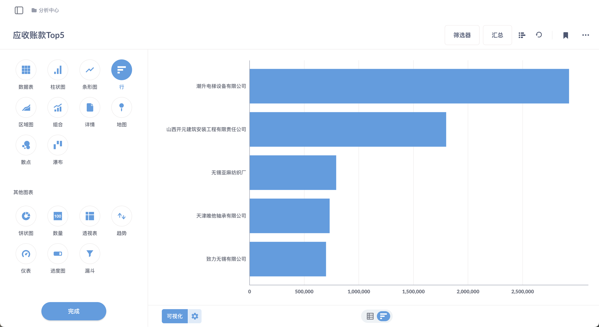

Steedos Analytics 是一个强大的数据分析工具，旨在帮助企业和开发者对业务数据进行可视化、分析和洞察。这个工具提供了多种数据分析功能和组件，支持用户构建自定义报表、仪表盘和数据查询。

- **可视化查询设计器**：通过可视化界面，用户可以轻松构建数据查询，无需编写复杂的 SQL 语句。用户可以选择数据源、设置查询条件，并定义显示方式。

- **自定义报表**：Steedos Analytics 支持创建自定义报表，用户可以根据业务需求添加图表、表格和其他数据展示组件。报表设计灵活，允许用户定制数据的呈现方式。

- **自定义仪表盘**：仪表盘功能使用户能够将多个报表组合在一起，创建综合性的数据概览。用户可以根据需要定制仪表盘的布局和组件。

- **多表联查**：支持对多个数据表进行关联查询，帮助用户跨表格进行数据分析。这对于企业涉及多种业务数据时非常有用。

- **数据透视表**：Steedos Analytics 支持数据透视表功能，用户可以根据特定维度和指标对数据进行聚合和分组，从而更深入地分析数据。

- **实时数据更新**：工具可以实时更新数据，确保分析结果的及时性和准确性。用户可以设置数据刷新间隔，保持数据的最新状态。

- **数据权限管理**：Steedos Analytics 提供数据权限控制，允许用户设置不同角色和用户组的访问权限，确保敏感数据的安全。

Steedos Analytics 是一个灵活而功能强大的数据分析工具，适合企业和开发者用于构建和分析业务数据。通过使用 Steedos Analytics，企业可以获取更深入的业务洞察，支持数据驱动的决策，提高业务效率。

## 报表

报表功能让用户能够以极其简单的方式对数据进行探索和分析。用户无需掌握任何编程或数据库查询语言，就可以通过几次点击生成复杂的数据查询。这项功能采用直观的图形界面，让用户可以选择数据源、设置筛选条件、并选择如何展示结果（例如图表或表格）。

## 仪表盘

仪表盘功能允许用户将多个查询结果集成到一个页面中，提供了一个高度定制化和动态的数据展示平台。用户可以在仪表盘中添加图表、表格、过滤器等组件，以创建全面的数据报告和分析视图。

## 权限

无需额外配置权限，无论是创建的报表还是将报表组合形成的仪表盘，统计分析平台数据权限直接继承华炎魔方对象权限；就会出现同一个报表或仪表盘不同业务权限的用户看到不同的数据的情况。

## 仪表盘参数

仪表盘展示页面除了可以放报表进行展示，在日常的应用中还会涉及到添加查询参数联动报表进行数据查询的场景，可以根据具体场景配置不同类型的查询参数。

## 添加到应用

创建好的仪表盘页面通过绑定选项卡后，添加到对应的应用中供用户进行访问查看。这样，用户就可以在前台看到对应的仪表盘页面了。

