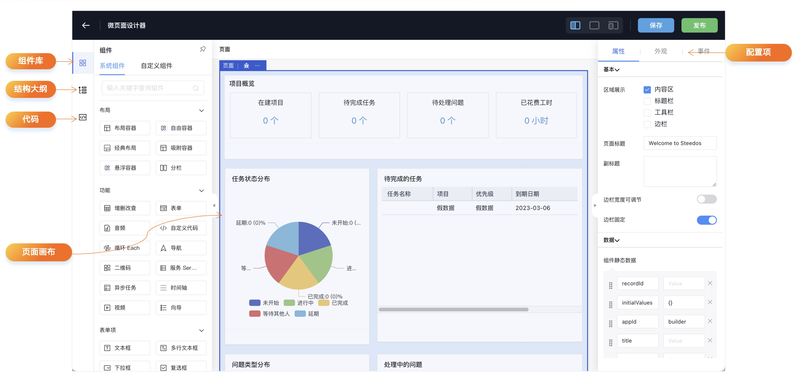

华炎魔方平台的微页面设计器是一款功能强大的界面工具，为用户提供直观的拖放方式，轻松设计和个性化他们的应用页面。借助全新引入的Amis渲染器，开发人员能够快速打造定制微页面，涵盖数据门户、记录详情、列表以及记录表单等系统页面。更为强大的是，微页面设计器作为一个多功能工具，还能够通过调用第三方接口，设计与数据展示或提交相关的页面，拓展了应用场景的多样性。此外，用户还可以便捷地通过设计器设计各种业务逻辑按钮，实现更深层次的定制和交互体验。

## 扩充字段属性

华炎魔方提供了一套基础属性设置功能，使用户能够轻松定义字段的必填性、宽度等基本属性。然而，如果用户希望进一步增强字段的功能，例如数值高亮提示、字段列表冻结等，这些需求可以利用微页面设计器来灵活扩展字段属性。这种灵活的扩展性使得华炎魔方在字段设置方面能够更好地适应各种复杂的业务场景，为用户提供了更广泛的功能选择和定制空间。

## 页面权限

我们根据各个业务场景的特点，精准地分配设计好的页面，以满足不同用户在不同应用或简档下的需求，确保他们看到定制化的页面效果。举个例子，比如针对付款业务对象在列表页针对管理员用户需要额外显示汇总的展示图表，而普通用户只可以看到列表页即可，这种情况就可以使用页面分配设置对应简档的用户，实现同一个业务对象的列表页不同身份的人员看到的效果不同。使用户能够更轻松地访问与其角色和权限相匹配的页面内容，从而更高效地完成工作任务。

## 版本控制

通过版本控制功能，所有发布的页面都会以对应的JSON格式文件存储。在设计器中首次保存设计内容后，系统将自动生成一个页面版本，用户可在微页面记录详情界面的“页面版本”子表中轻松查看。每当用户点击发布按钮时，当前最新的页面版本将被标记为“已发布”，而每次在设计器中修改并保存已发布过的微页面后，都会生成一个新的待发布页面版本。

此外，配置的页面可以通过VS Code插件实现与项目源码的同步，从而实现对页面元数据的版本管理。使开发团队能够更好地协作和跟踪页面设计的变更。

## 自定义组件

微页面设计器不仅仅局限于低代码模式。对于具有特定需求的用户，也可以创建完全定制的组件，以扩充组件功能。实际上，微页面设计器可以被视为普通的UI库，支持以90%低代码和10%代码开发的混合模式。这种混合模式不仅提升了开发效率，同时也保持了足够的灵活性，让用户能够根据具体需求定制功能更加丰富的页面。即使面对最独特的业务场景，用户也能够通过微页面设计器快速实现所需的功能，同时保持代码开发的灵活性和可控性。

